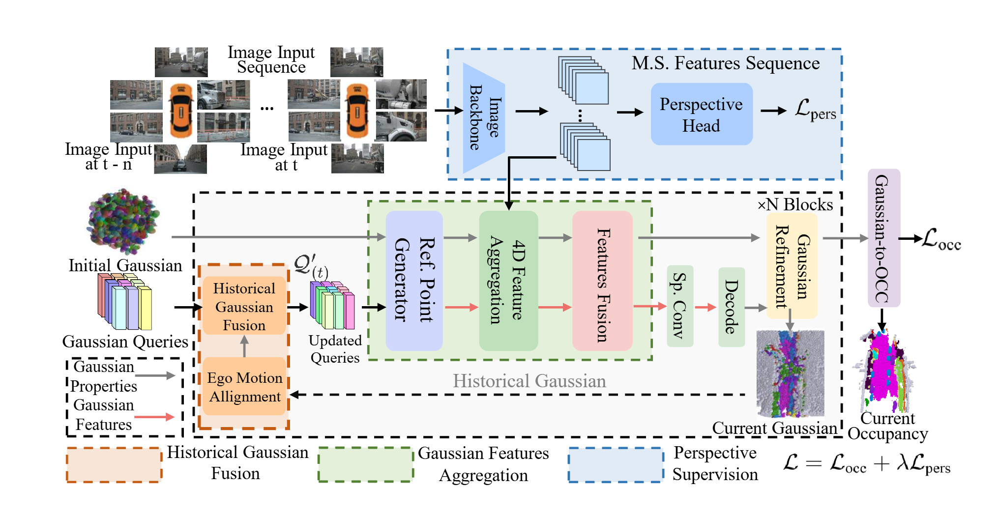

# Gaussian4DOCC

Gaussian Occupancy Prediction with Temporal Information Extraction and Spatiotemporal Fusion


### Abstract

In autonomous driving, occupancy prediction is an emerging and mainstream perception system that predicts the spatial occupancy and semantics of 3D voxel grids around the autonomous vehicle from image inputs. However, occupancy prediction generally requires dense occupancy representations with redundant computing. Although 3D Gaussian has recently been applied to improve occupancy prediction, the existing Gaussian occupancy predictions still have many issues, such as inefficient Gaussian representation, Gaussian distribution distortion, and sparse supervision signal. In this work, we propose a novel Gaussian occupancy prediction, called Gaussian4DOCC, to solve these issues by considering temporal information extraction and spatiotemporal fusion, which consists of three modules: 1) historical Gaussian fusion, 2) Gaussian feature aggregation, and 3) perspective supervision. We conducted experiments for an ablation study and compared Gaussian4DOCC to the stateof-the-art occupancy predictions on the well-known dataset nuScenes. The results show that the temporal information extraction and spatiotemporal fusion contribute to the improvement of occupancy prediction and our Gaussian4DOCC outperforms the existing occupancy predictions. Finally, we release the opensource code, video description, and datasets to facilitate Gaussian occupancy prediction in autonomous driving.

> [!CAUTION]
> **NON-STABLE VERSION WARN**
>
> This is under review. The content in this repository may be updated.




**IN THIS WORK**

- We propose a novel Gaussian fusion to merge the current Gaussian features with the historical Gaussian spatial distribution, which introduces prior Gaussian features to update the spatial updating scale for reducing inefficient Gaussians in empty regions and improving Gaussian representation efficiency. 
- We propose a novel Gaussian feature aggregation to alleviate the Gaussian distribution distortion in occlusion scenarios by fusing temporal information, which introduces a 4D spatiotemporal sampling of continuous image inputs and aggregates Gaussian query sequences to improve occupancy prediction in occlusion scenarios. 
- We propose perspective supervision as an auxiliary loss to improve the supervision density of the areas of interest during training, thus improving occupancy prediction accuracy.

Extensive experiments on the well-known **nuScenes** dataset demonstrate that Gaussian4DOCC outperforms existing state-of-the-art occupancy prediction methods by leveraging temporal and spatiotemporal cues.

We provide open-source code, datasets, and video demonstrations to support research and development in Gaussian-based occupancy prediction for autonomous driving.

Feel free to explore the repository for code, pretrained models, and evaluation scripts.

---

## Video & Visualization


## Installation

The overall installation includes four parts:

- Create conda environment
- Install PyTorch
- Install packages 
- Install custom CUDA ops
- Install visualize packages(optional)

### Environment

```shell
conda create -n gs4docc python=3.8.16
conda activate gauss4d
```

### PyTorch

```shell
pip install torch==2.0.0 torchvision==0.15.1 torchaudio==2.0.1 --index-url https://download.pytorch.org/whl/cu118
```

### Install packages

Install necessary packages into conda environment

```shell
#from MMLab
pip install openmim
mim install mmcv==2.0.1
mim install mmdet==3.0.0
mim install mmsegmentation==1.0.0
mim install mmdet3d==1.1.1

#Others
pip install spconv-cu117
pip install timm
```

### Install custom CUDA ops

```shell
cd model/encoder/gaussian_encoder/ops && pip install -e .
cd model/head/localagg && pip install -e 
```

### Install package for visualize(optional)

```shell
pip install pyvirtualdisplay mayavi matplotlib==3.6.0 PyQt5
```


## Dataset

- Download **nuScene** dataset from [HERE](https://www.nuscenes.org/download) (V1.0 full data).

- Download occupancy annotations from **SurroundOcc**([HERE](https://github.com/weiyithu/SurroundOcc)).

- Download **.pkl** files [HERE](https://cloud.tsinghua.edu.cn/d/bb96379a3e46442c8898/).

- Download `can_bus` from [HERE](https://d36yt3mvayqw5m.cloudfront.net/public/v1.0/can_bus.zip).


**Folder structure**

```
Gaussian4DOCC
├── ...
├── data/
│   ├── nuscenes/
│   │   ├── maps/
│   │   ├── samples/
│   │   ├── sweeps/
│   │   ├── v1.0-test/
|   |   ├── v1.0-trainval/
|   │   ├── can_bus/
|   │   │   ├── can_bus/
│   │   |   ├── ...
│   ├── nuscenes_cam/
│   │   ├── nuscenes_infos_train_sweeps_occ.pkl
│   │   ├── nuscenes_infos_val_sweeps_occ.pkl
│   │   ├── nuscenes_infos_val_sweeps_lid.pkl
│   ├── surroundocc/
│   │   ├── samples/
│   │   |   ├── xxxxxxxx.pcd.bin.npy
│   │   |   ├── ...
```


## Getting started

Clone project:

```shell
git clone https://github.com/Pluviophil3/Gaussian4DOCC.git
cd Gaussian4DOCC
```


### Inference
Download the checkpoints from [HERE](https://drive.google.com/drive/folders/1L9O88UqO1Oxtjo2FG-oNqwn_kNRUQ3pC?usp=sharing).

You can use the following command to perform inference with these pre-trained weights below:

| Type           | Gaussians | IoU | mIoU |
|----------------|-----------|-----|------|
| Gaussian4DOCC  | 25600     | 31.31  | 20.22   |
| Gaussian4DOCC  | 51200     | 32.20  | 20.65   |

```shell
python eval.py --py-config config/gs4docc_25600.py --work-dir out/eval --resume-from weights/25600.pth
```

### Train

You can use the following command to train with dataset(e.g. nuScenes):

```shell
python train.py --py-config config/gs4docc_25600.py --work-dir out/train
```

### Visualize

You can visually examine the inference results through visualize tools

```shell
python visualize.py --py-config config/gs4docc_25600.py --work-dir out/vis --resume-from weights/51200.pth --vis-occ --vis-gaussian --num-samples 3
```